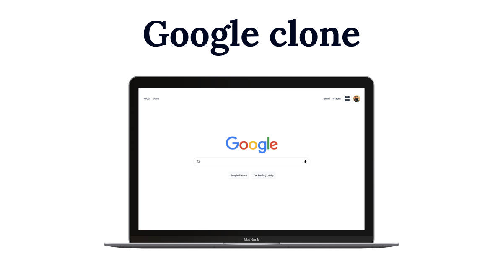

# Google Clone Project



## Description

This web app is a clone of Google search engine built with `Next.js`, `Tailwind`, `Google Search API`, `Hero Icons` and hosted on `Vercel`.

[Blog post link](https://www.kirillso.com/blog/google-clone-project)

[Project link](https://google-nextjs-kirill.vercel.app/)

## How I worked on this project

I created this project to expand on the data fetching skills and learn a bit more on possibilities of Next.js especially in combination with utility design framework such as Tailwind.

## How to navigate this project

- `search.js` - using getServerProps to fetch the google API. There is a useDummyData switcher that takes `Response.js` in the main folder and populates the results with static data to avoid exhausting API limit if the value is `true`.
- Environmental variables - it was the first time I tried to implement `.env.local` so that the API keys are not exposed publicly and used `${process.env.API_KEY}`.
- `SearchResults.js` - takes the results of the API response and renders them via `map()` method as well as passes various props such as title, link and snippets of results with Tailwind styling.
- Hero Icons library - is used to visualize various options in the `HeaderOptions.js`

## Why it is built this way

- State management is not used with this project as its a simple app mainly to test out API fetch, render and styling.
- Tailwind CSS is a great library for styling. The utility classes make it super easy to rapidly style any components and make the app look usable.
- `Next.js` and `Vercel` made it easy to generate and host this application but for the next project I will use more layers of complexity including databases.

## What else would I do

- Finish video, image search sections so that the app is more robust.
- Add end-to-end tests with Cypress
- Setup CI/CD and ESLint on every pull request

# Scripts

## Getting Started

First, run the development server:

```bash
npm run dev
# or
yarn dev
```

Open [http://localhost:3000](http://localhost:3000) with your browser to see the result.

You can start editing the page by modifying `pages/index.js`. The page auto-updates as you edit the file.

[API routes](https://nextjs.org/docs/api-routes/introduction) can be accessed on [http://localhost:3000/api/hello](http://localhost:3000/api/hello). This endpoint can be edited in `pages/api/hello.js`.

The `pages/api` directory is mapped to `/api/*`. Files in this directory are treated as [API routes](https://nextjs.org/docs/api-routes/introduction) instead of React pages.

## Learn More

To learn more about Next.js, take a look at the following resources:

- [Next.js Documentation](https://nextjs.org/docs) - learn about Next.js features and API.
- [Learn Next.js](https://nextjs.org/learn) - an interactive Next.js tutorial.

You can check out [the Next.js GitHub repository](https://github.com/vercel/next.js/) - your feedback and contributions are welcome!

## Deploy on Vercel

The easiest way to deploy your Next.js app is to use the [Vercel Platform](https://vercel.com/new?utm_medium=default-template&filter=next.js&utm_source=create-next-app&utm_campaign=create-next-app-readme) from the creators of Next.js.

Check out our [Next.js deployment documentation](https://nextjs.org/docs/deployment) for more details.
